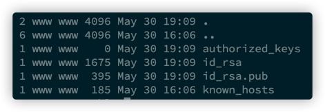
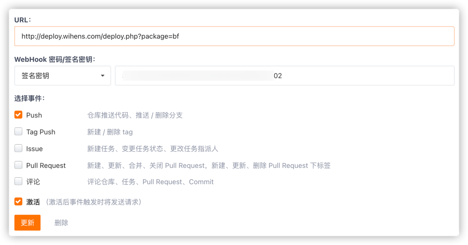
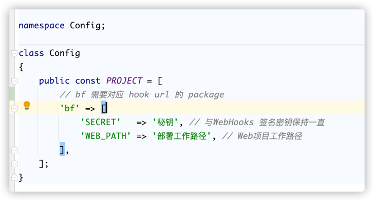
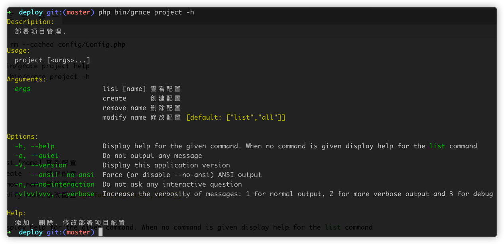

# deploy

#### Description
Automated Deployment

#### Software Architecture
Automated deployment using webhook to automate project deployment and release with support for Gitee/Github/Gitlab.

#### Installation

1.  Deploy the project to the distribution server and make sure it can be accessed by webhook properly；
2.  Push the project source code to the repository and create the ssh access public key on the server to ensure encryption-free access；
    > The ssh key file is usually stored under `/home/www/.ssh`, you can determine the `www` user directory by `finger www`

3.  Go to the repository project - Setting - Webhooks to configure the event notification hook, `WebHook password/signing key` select `SIGNING KEY`, the value should be the same as the corresponding project name package under the deployment script `config/Config.php` (the name should not contain special `. `, `$` and other special symbols, otherwise the project may not be parsed and deployed properly); URL: `http://domain/deploy.php?package=package`

- Gitee
  
- Github
  

4.  Project Configuration `config/Config.php`

- Gitee
  

5.  Important: Make sure the owner of all files and directories under the project, including the hidden file `.git`, is `www`.
6.  The project deployment script needs to be placed in the root directory (i.e. WEB_PATH), the file format is yaml, the file name must be `deploy-ci.yml`, please refer to the project file for details.
7.  Add command line management tools：
    - `php bin/grace project list [all]` View Configuration
    - `php bin/grace project create` Create Configuration
    - `php bin/grace project modify project_name` Modify Configuration
    - `php bin/grace project remove project_name` Remove Configuration

#### Instructions

1.  Push test release results；

#### Feature

1.  Support Gitlab
2.  Support Github
3.  Console manager
4.  Support Gitee

#### Contribution

1.  zrone <xujining2008@126.com>
